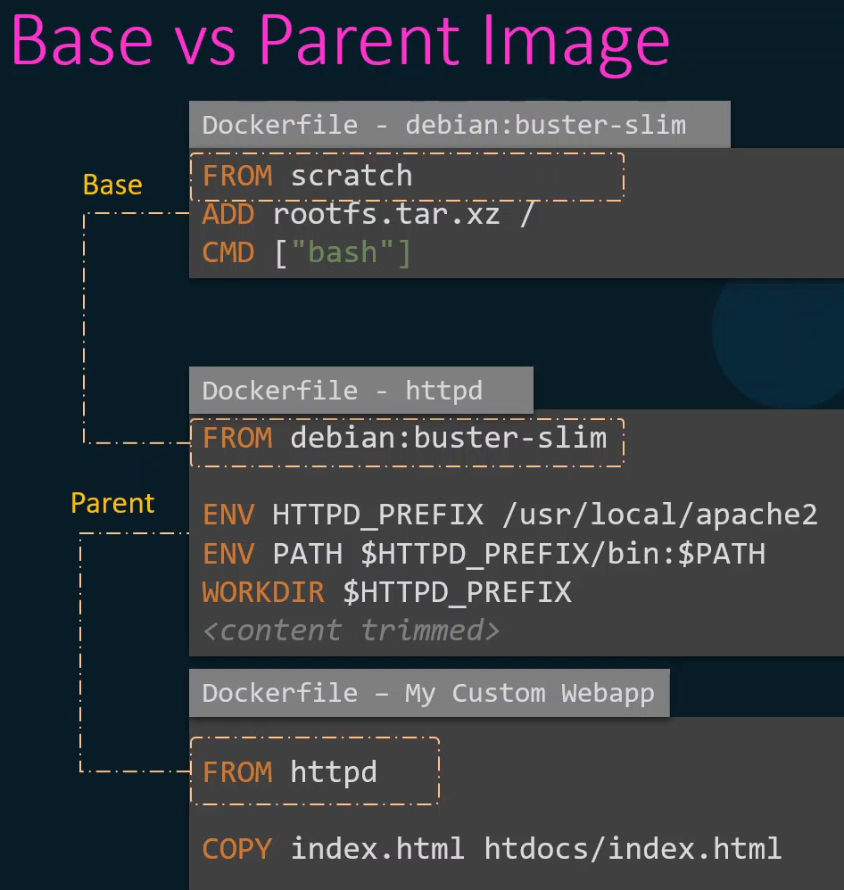
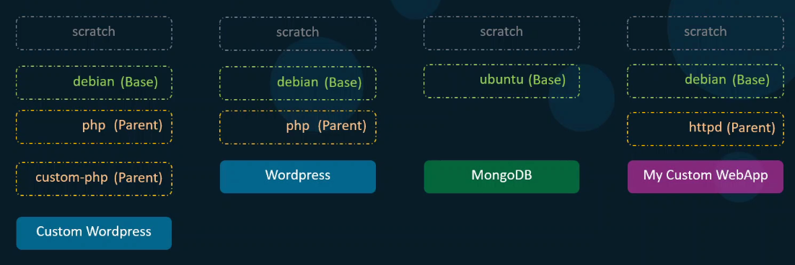

 

Для нашего кастомного образа образ `httpd` является родительским (parent).

Образ `debian:buster-slim` является базовым (base), т.к. собран с нуля (`FROM scratch`).

`scratch` - это в буквальном смысле "пустой" образ, название зарезервировано Docker-ом. С него создаются все базовые образы.

 