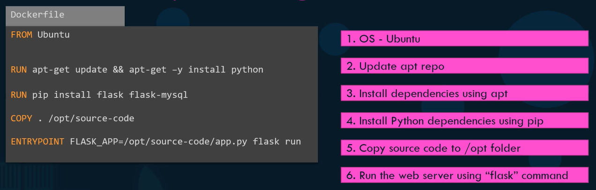

<br>

Структура Dockerfile:

```Dockerfile
INSTRUCTION ARGUMENT
```

Пример:

```Dockerfile
FROM ubuntu

RUN apt-get update && apt-get -y install python
RUN pip install flask flask-mysql
COPY . /opt/source-code
ENTRYPOINT FLASK_APP=/opt/source-code/app.py flask run
```

```shell
$ docker build . -f Dockerfile -t frenzy88/my-custom-app
$ docker push frenzy88/my-custom-app
```

При сборке все слои кэшируются. Если один из этапов создания образа завершился ошибкой (либо мы добавили новый слой), при повтором запуске Docker не начинает сборку с нуля, а обращается в кэш и продолжает с того места, где остановился.

Сборка демо-образа с httpd:

```shell
docker image build -t frenzy88/kodekloudwebimage:v1 .
```

Сборка демо-образа с tomcat (репозиторий https://github.com/yogeshraheja/dockertomcat):

```shell
docker image build -t frenzy88/tomcatone:v1 .
```

В процессе сборки образа мы можем переопределить переменную с версией tomcat:

```shell
docker image build -t frenzy88/tomcatone:v2 --build-arg tomcat_version=8.5.8 .
```