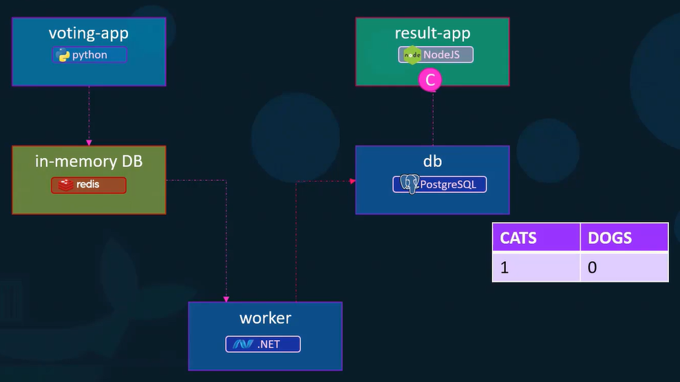

Если нам нужно запустить сразу несколько контейнеров, из которых состоит наше приложение, на помощь приходит Docker Compose.

Вместо множества команд:

```shell
$ docker run frenzy88/simple-webapp
$ docker run mongodb
$ docker run redis:alpine
$ docker run ansible
```

Мы можем написать `docker-compose.yml`:

```yaml
services:
  web:
    image: "frenzy88/simple-webapp"
  database:
    image: "mongodb"
  messaging:
    image: "redis:alpine"
  orchestration:
    image: "ansible"
```

А затем поднять все контейнеры одной командой: `docker compose up -d`.

Если что-то изменили в yaml-файле и нужно применить изменения: `docker compose up -d --build`.

Важно понимать, что все контейнеры поднимаются на одном Docker-хосте.

### Архитектура demo-приложения Voting App

<br>

Опция `--link` командной строки нужна для связи двух контейнеров друг с другом (legacy). Когда мы запускаем контейнеры через `docker container run`, то они подключаются к дефолтной сети `bridge`, где не работает разрешение имен, т.к. используется DNS-сервер самого Docker-хоста. Поэтому в данном случае можно воспользоваться опцией `--link`, чтобы резолв имен заработал.

```shell
$ docker run -d --name=redis redis
$ docker run -d --name=db postgres
$ docker run -d --name=vote -p 5000:80 --link redis:redis voting-app   # первый redis - имя контейнера, второй redis - имя хоста redis в коде voting-app, своего рода маппинг имен
$ docker run -d --name=result -p 5001:80 --link db:db result-app
$ docker run -d --name=worker --link db:db --link redis:redis worker
```

При создании линка фактически в файле `/etc/hosts` контейнера `vote` создается запись:

```shell
172.17.0.2 redis 89cd8eb563da
```

Если перевести команды выше в Docker Compose:

```yaml
services:
  redis:
    image: redis

  db:
    image: postgres:9.4

  vote:
    image: voting-app
    ports:
      - 5000:80
    links:
      - redis

  result:
    image: result-app
    ports:
      - 5001:80
    links:
      - db   #здесь db=db:db

  worker:
    image: worker-app
    links:
      - redis
      - db
```

В случае если нам нужно сначала собрать свои образы мы можем вместо опции `image` указать опцию `build`:

```yaml
services:
  redis:
    image: redis

  db:
    image: postgres:9.4

  vote:
    build: ./vote   #каталог с кодом приложения и Dockerfile
    ports:
      - 5000:80
    links:
      - redis

  result:
    build: ./result
    ports:
      - 5001:80
    links:
      - db

  worker:
    build: ./worker
    links:
      - redis
      - db
```

Существуют различные версии Docker Compose файлов со своими особенностями и ограничениями.

Так например в `version: 1` нельзя было указать другую сеть для контейнера кроме как дефолтную `bridge` или определить порядок старта контейнеров. Т.е. все контейнеры подключались к дефолтной `bridge`-сети, а для взаимодействия между контейнерами использовались link.

В `version: 2` появилось ключевое слово `services` в начале файла.

При использовании `version: 2` и выше необходимо указывать версию в самом начале файла, перед ключевым словом `services`.

```yaml
version: 2

services:
  redis:
    image: redis

  db:
    image: postgres:9.4

  vote:
    image: voting-app
    ports:
    - 5000:80
```

В `version: 2` теперь автоматически создается выделенная `bridge`-сеть и все контейнеры подключаются к ней. **При использовании docker compose контейнеры могут разрешать имя друг друга по названию сервиса** (`db`, `redis` и т.д.), а не по имени контейнера. Таким образом в `version: 2` нет необходимости использовать link-и.
Также в `version: 2` добавили порядок старта контейнеров:

```yaml
version: 2

services:
  redis:
    image: redis

  db:
    image: postgres:9.4

  vote:
    image: voting-app
    ports:
      - 5000:80
    depends_on:
      - redis   #контейнер vote запустится только после старта redis
```

В `version: 3` появилась поддержка Docker Swarm.

Предположим, что мы решили разнести компоненты нашего приложения по разным сетям.

Пользовательский трафик - сеть `front-end` (компоненты `vote` и `result`).

Внутренний трафик приложения - сеть `back-end` (компоненты `redis`, `db`, `worker`).

```yaml
version: 2

services:
  redis:
    image: redis
    networks:
      - back-end

  db:
    image: postgres:9.4
    networks:
      - back-end

  vote:
    image: voting-app
    networks:
      - front-end
      - back-end

  result:
    image: result
    networks:
      - front-end
      - back-end

networks:
  front-end:
  back-end:
```

Which command can be used to **stop (only and not delete)** the whole stack of containers created by compose file?

```shell
$ docker compose stop
```

Which command can be used to **delete** the application stack created using compose file?

```shell
$ docker compose down
$ docker compose rm   # удалить остановленные контейнеры
```

What is the command to list the containers created by compose file?

```shell
$ docker compose ps
```

What is the command to check the logs for the whole stack defined inside compose file?

```shell
$ docker compose logs
```

What is the command to see the running process inside of containers created by compose file?

```shell
$ docker compose top
```

Instead of, or as well as, specifying your own networks, you can also change the settings of the app-wide default network by defining an entry under `networks` named `default`:

```yaml
networks:
  default:
    name: geomate-platform
    ipam:
      driver: default
      config:
        - subnet: 172.18.0.0/26
          ip_range: 172.18.0.0/26
```

В данном примере мы определяем настройки для дефолтной сети, создаваемой docker compose. По умолчанию сеть получает название, которое формируется из имени каталога, содержащего `docker-compose.yaml` плюс слово `default`. Например `apps_default`. Здесь же мы явно указываем имя для этой сети - `geomate-platform`. Секция `ipam` (IP Address Management) определяет сетевые настройки, подсеть, диапазон адресов и прочие.

Далее в другом файле `docker-compose.yaml` мы хотим использовать эту сеть, чтобы не создавать новую. If you want your containers to join a pre-existing network, use the `external` option.

```yaml
networks:
  default:
    name: geomate-platform
    external: true
```