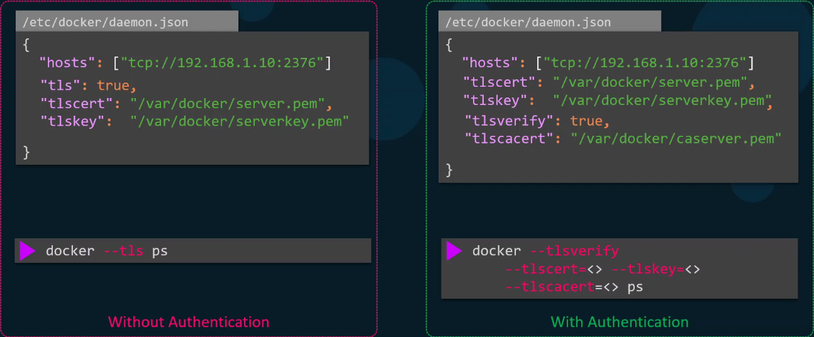

Зачем обеспечивать безопасность Docker Daemon? Как злоумышленник, получивший доступ к Docker Daemon, может навредить нам?

1. Злоумышленник может удалить контейнеры с приложением.
2. Злоумышленник может удалить volume-ы с данными.
3. Злоумышленник может запустить свои собственные контейнеры (например для майнинга).
4. Злоумышленник может получить root-доступ к хостовой системе, запустив privileged-контейнер. А далее атаковать другие хосты в нашей инфраструктуре.

В первую очередь нам нужно защитить доступ к самому Docker-хосту в соответствии с best practices (отключение root-пользователей, контроль списка лиц, имеющих доступ к серверу, отключение аутентификации по паролю, включение аутентификации только по ssh, отключение неиспользуемых портов и т.д.)

Если же нам потребовалось опубликовать Docker Daemon наружу, то важно делать это только на интерфейсе во внутренней сети организации.

Также при публикации наружу важно настроить TLS.

Конфигурация демона:

```json
{
    "hosts": ["tcp://192.168.56.104:2376"],
    "tlscert": "/var/docker/server.pem",
    "tlskey": "/var/docker/serverkey.pem",
    "tlscacert": "/var/docker/caserver.pem",
    "tlsverify": true
}
```

Конфигурация внешнего клиента:

```shell
export DOCKER_HOST="tcp://192.168.56.104:2376"
export DOCKER_TLS_VERIFY=true
```

Кроме этого на клиенте необходимо положить в каталог `~/.docker` клиентские ключ/сертификат и сертификат CA.

Либо вместо определения переменных окружения можно передавать аргументы командной строки:

```shell
$ docker --tlsverify --tlscert=<> --tlskey=<> --tlscacert=<> ps
```

Таким образом доступ к демону смогут получить только те клиенты, у которых сертификат подписан нашим CA.

<br>

https://docs.docker.com/engine/security/protect-access/