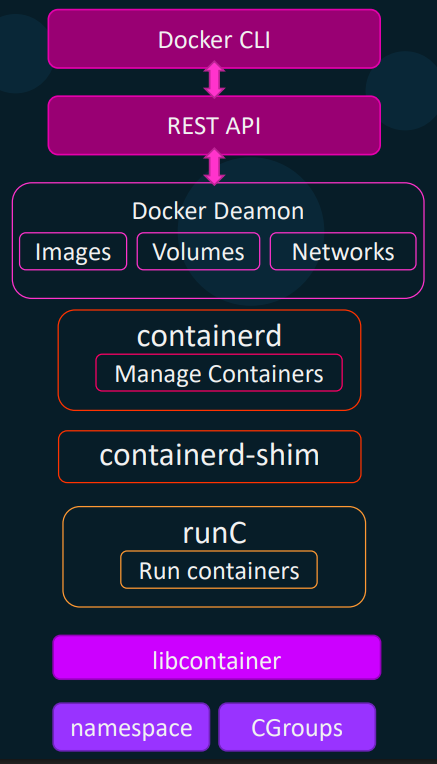

Docker Engine состоит из трех ключевых компонент:

- *Docker Daemon* - отвечает за создание и управление образами, контейнерами, томами и сетями на хосте
- *REST API* - предоставляет интерфейс для управления сущностями Docker
- *Docker CLI* - интерфейс командной строки для управления сущностями Docker

В прошлом Docker использовал технологию LXC для управления контейнерами. LXC использует такие возможности ядра Linux как *namespaces* и *cgroups* для создания контейнеров. Однако работать напрямую с LXC для обычного пользователя было тяжело. А Docker предоставил набор инструментов, который делал процесс управления контейнерами более простым.

В версии v0.9 Docker добавил свою собственную среду исполнения *libcontainer*, которая написано на Go (на этом же языке написан и сам Docker), что в свою очередь уменьшило зависимость Docker от технологии LXC.

Теперь с помощью libcontainer Docker мог напрямую взаимодействовать с такими фичами ядра Linux как namespaces и cgroups. Таким образом libcontainer заменил LXC в качестве среды исполнения по умолчанию для Docker.

*OCI* расшифровывается как Open Container Initiative и состоит из спецификации образов (image-spec) и спецификации среды исполнения (runtime-spec).

*Runtime-spec* определяет стандарты того, каким образом container runtime должна разрабатываться, жизненный цикл контейнера и пр. Например команда `create` должен создавать контейнер, команда `start` должна запускать контейнер, команда `delete` должна удалять контейнер и т.д.

*Image-spec* означает спецификации того, каким образом должен собираться образ.

Когда-то Docker Daemon представлял из себя большую монолитную кодовую базу, которая объединяла в себе множество функций, таких как управление контейнерами, образами, сетями, томами на Docker-хосте.

С внедрением OCI архитектура Docker Daemon была пересмотрена и разбита на небольшие переиспользуемые компоненты, начиная с версии v1.11.

 

Часть, которая запускает контейнеры, стала независимым компонентом под названием *runC*. Сейчас вы можете запускать контейнеры просто установив runC, без необходимости установки самого Docker.

Демон, который управляет контейнерами, стал независимым компонентом под названием *containerd*. Теперь он управляет компонентом runC, который в свою очередь использует libcontainer для создания контейнеров на хосте.

Что произойдет с контейнерами, если сам демон упадет или будет перезапущен? Чтобы справиться с этой ситуацией и сделать контейнеры "демононезависимыми", был добавлен новый компонент *containerd-shim*. Теперь вместо containerd контейнерами управляет containerd-shim. Даже если Docker Daemon упадет или будет перезапущен, контейнеры продолжат работать в фоновом режиме и будут приаттачены обратно, когда демон вернется онлайн.

Подытожим. Когда мы выполняем команду `docker container run -it ubuntu`, Docker CLI конвертирует команду в RESTful API, которая затем передается в Docker Daemon. Docker Daemon первым делом проверяет доступен ли указанный образ в локальной ФС. Если нет, образ скачивается из Docker Registry. Как только образ загружен, Docker Daemon обращается к containerd для запуска контейнера. Containerd отвечает за конвертацию загруженного образа в OCI-совместимый bundle. Далее bundle передается в containerd-shim, который в свою очередь вызывает runC для запуска контейнера. RunC взаимодействует с namespaces и cgroups ядра для создания контейнера.

- `docker version` - покажет версию CLI-клиента и версию Docker Daemon
- `docker --version` - покажет только версию CLI-клиента
- `docker system info` - покажет общую инфу о Docker-хосте