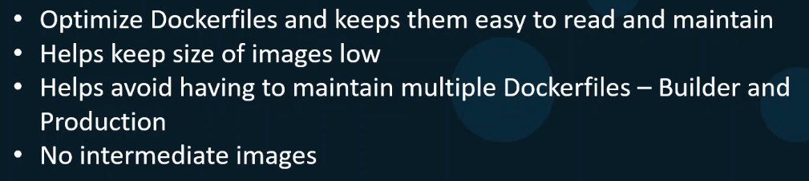

Команда `npm run build` создает каталог `dist` и помещает туда все необходимое для запуска NodeJS-приложения.

Создаем Dockerfile для запуска приложения в контейнере:

```Dockerfile
FROM nginx

COPY dist /usr/share/nginx/html
CMD [ "nginx", "-g", "daemon off;" ]
```

<br>

В данном сценарии сборка приложения происходит в два этапа: сначала локально выполняется `npm run build`, а затем каталог `dist` переносится в контейнер. Однако со временем пакеты и библиотеки, установленные на локальном сервере и используемые для сборки, могут устареть, что в свою очередь может привести к проблемам со сборкой приложения. Кроме того, если мы захотим перенести процесс сборки на другой сервер, то на нем должны быть установлены все необходимые зависимости нужной версии. Поддержка подобного решения может быть довольно проблематичным занятием.

Поэтому стоит контейнеризировать и сам процесс сборки. Поэтому создадим еще один Dockerfile.builder:

```Dockerfile
FROM node

COPY . .
RUN npm install
RUN npm run build
```

<br>

В этом случае нам каждый раз нужно пересобирать оба образа. А все что нам нужно от образа `builder` - это каталог `dist`. Как нам передать данный каталог из одного образа в другой? Может написать bash-скрипт, который создает (даже не запускает) временный контейнер, копирует из него нужную директорию на локальный хост и затем удаляет контейнер:

<br>

Процесс выглядит сложным и неудобным. Поэтому на помощь приходит **Multi-Stage Builds**.

При передаче каталога из одного stage в другой можно указывать номер stage:

```Dockerfile
FROM node

COPY . .
RUN npm install
RUN npm run build

FROM nginx

COPY --from=0 dist /usr/share/nginx/html
CMD [ "nginx", "-g", "daemon off;" ]
```

Либо можно задать для stage имя и ссылаться на него:

```Dockerfile
FROM node AS builder

COPY . .
RUN npm install
RUN npm run build

FROM nginx

COPY --from=builder dist /usr/share/nginx/html   # можно указать номер stage
CMD [ "nginx", "-g", "daemon off;" ]
```

При сборке образа мы можем указать название целевой stage:

```shell
docker image build --target builder -t my-app .
```

Преимущества Multi-Stage Builds:

<br>