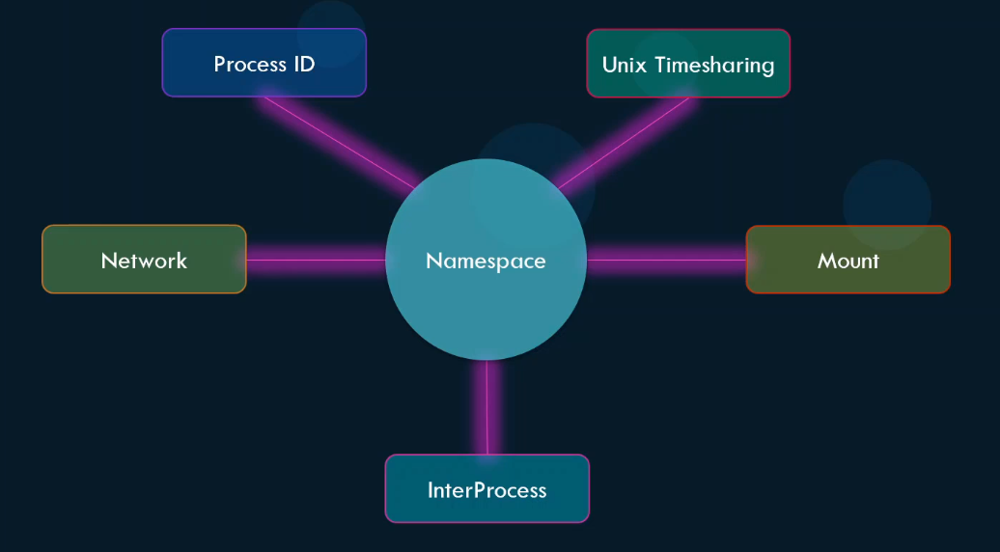
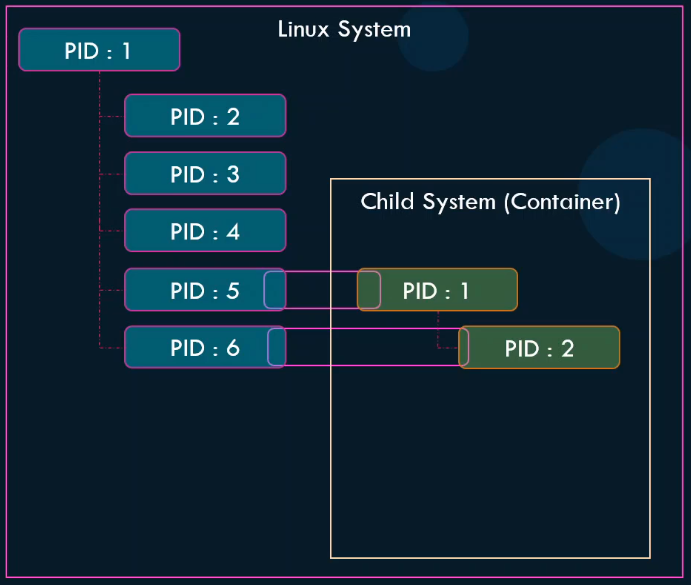

Для изоляции контейнеров Docker использует механизм namespaces. Изолируются следующие сущности:

- Process ID
- Network
- Mount
- InterProcess
- Unix Timesharing

<br>


### Namespace - Process ID

Когда загружается ОС Linux, сначала стартует корневой процесс с PID 1, а от него уже порождаются остальные процессы. Процессы уникальны и два процесса не могут иметь одинаковые PID.

Когда мы создаем контейнер - это похоже на дочернюю ОС, которая должна думать, что располагает собственным набором процессов, начиная с корневого процесса с PID 1. Но как мы знаем не существует жесткой изоляции между контейнерами и Docker-хостом. Фактически процессы запущенные в контейнере - это процессы запущенные на Docker-хосте. Два процесса не могут иметь PID 1, и тут в игру вступают Process ID Namespaces. Каждый процесс может быть ассоциирован с несколькими Process ID (при условии, что эти Process ID относятся к разным namespaces). Когда процесс запускается в контейнере, фактически это другой процесс на Docker-хосте и он получает следующий доступный Process ID хоста. То есть в контейнере это может быть процесс с PID 1, а фактически на Docker-хосте это может быть например процесс с PID 5.

<br>

Контейнер видит процессы только в своем namespace и не видит процессы за его пределами. Docker-хост в свою очередь видит процессы во всех namespaces.

Таким образом процессы контейнеров запускаются на одном и том же Docker-хосте, но при этом в своих собственных namespace-ах.

### Users

По умолчанию Docker запускает процессы в контейнерах под пользователем `root`.

Однако мы можем переопределить пользователя при запуске контейнера:

```shell
$ docker run -d --rm --name=test --user=1000 ubuntu sleep 3600
```

Также можно переопределить пользователя на этапе сборки образа:

```Dockerfile
FROM ubuntu

USER 1000
```

Docker использует набор security features для ограничения возможностей пользователя `root` в контейнере. Таким образом пользователь `root` в контейнере на самом деле не похож на пользователя `root` на Docker-хосте.

Для реализации этих ограничений Docker использует *Linux Capabilities*.

The Linux capabilities feature breaks up the privileges available to processes run as the `root` user into smaller groups of privileges. This way a process running with `root` privilege can be limited to get only the minimal permissions it needs to perform its operation.

https://docs.redhat.com/en/documentation/red_hat_enterprise_linux_atomic_host/7/html/container_security_guide/linux_capabilities_and_seccomp#linux_capabilities_and_seccomp

По умолчанию Docker запускает контейнер с ограниченным набором capabilities, поэтому процесс, запущенный в контейнере, не может к примеру выполнить перезагрузку Docker-хоста.

Можно выдать необходимые capabilities при запуске контейнера:

```shell
$ docker run --cap-add MAC_ADMIN ubuntu
```

Либо наоборот убрать:

```shell
$ docker run --cap-drop KILL ubuntu
```

Можно запустить контейнер с полным набором привилегий:

```shell
$ docker run --privileged ubuntu
```