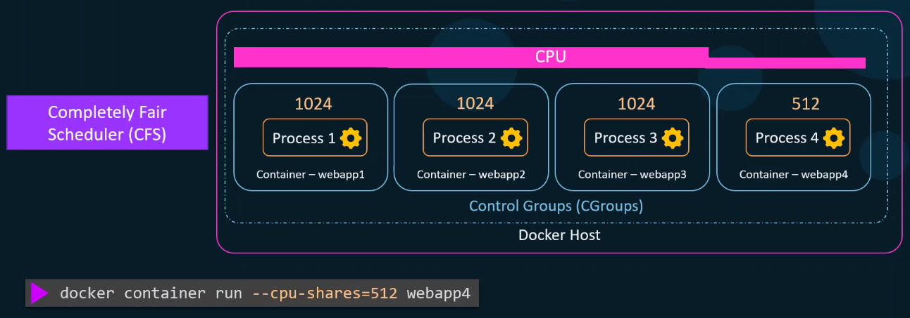
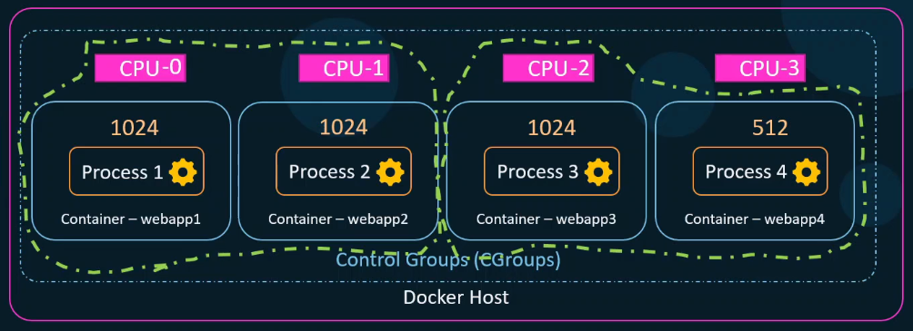
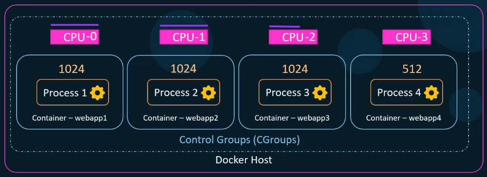

По умолчанию для контейнеров отсутствуют какие-либо ограничения на использование ресурсов хоста. Если потребуется, один контейнер может утилизировать все ресурсы хоста, лишая тем самым другие контейнеры и даже сам Docker-хост этих драгоценных ресурсов.

Когда ядро обнаруживает, что память на хосте исчерпана, то начинает убивать процессы для высвобождения памяти. Это необязательно будут процессы контейнеров. Это могут быть и процессы самого хоста.

Каким образом один процессор (или одно ядро процессора) делится между двумя процессами? Каждый процесс получает одинаковое количество процессорного времени. Первый процесс выполняется в течение нескольких циклов и затем ждет, пока второй процесс занимает процессорное время для своего выполнения. И так по кругу пока оба процесса не завершатся.

Обычно время, выделяемое каждому процессу, составляет считанные микросекунды, а переключение между процессами происходит так быстро, что это незаметно для пользователя. Конечный пользователь думает, что процессы работают одновременно, хотя на уровне процессора это не так.

Если один процесс имеет более высокий приоритет, то он получает больше процессорного времени. Например если мы назначим для одного процесса значение CPU share равное 1024 и 512 для другого, то первый процесс получит в два раза больше процессорного времени. Однако важно понимать, что это не жесткие значения лимитов. Это показывает нам сколько CPU shares один процесс получил больше относительно другого. Если у нас всего один процесс со значением CPU share равным например 512, то он получит вообще все процессорное время в монопольное использование, т.к. нет других конкурентов. Таким образом CPU shares играют роль только в случае, когда один процесс соревнуется с другими за процессорное время.

**CFS (Completely Fair Scheduler)** отвечает за распределение процессорного времени между процессами.

Docker начиная с версии 1.13 поддерживает также Realtime Scheduler.

Каждый контейнер по умолчанию получает CPU share равное 1024. Это значит, что каждый контейнер получает одинаковое количество процессорного времени. Это значение можно переопределить при запуске контейнера:

```shell
$ docker container run --cpu-shares=512 webapp4
```

<br>

Т.е. в данном случае эти четыре контейнера могут использовать все доступные ресурсы CPU, только первые три в равной степени, а четвертый в два раза меньше, относительно других.

Каким образом мы можем строго ограничить использование процессорного времени?

Первый способ - ограничить контейнеры только определенными CPU.

```shell
$ docker container run --cpuset-cpus=0-1 webapp1
$ docker container run --cpuset-cpus=0-1 webapp2
$ docker container run --cpuset-cpus=2 webapp3
$ docker container run --cpuset-cpus=2 webapp4
```

<br>

В данном примере CPU3 остался свободным под другие процессы.

Второй способ.

```shell
$ docker container run --cpus=2.5 webapp4   # контейнер может использовать 2.5 процессора из 4 имеющихся (62%)
```

<br>

Можно обновить это значение для запущенного контейнера:

```shell
$ docker container update --cpus=0.5 webapp4
```