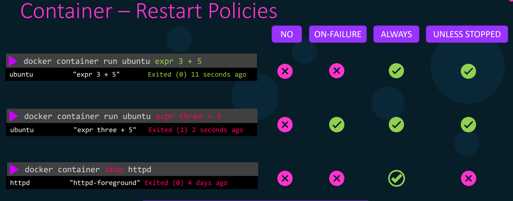

Задать политику перезапуска контейнера:

```shell
docker container run --restart=<policy_name> ubuntu
```

<br>

Политики могут быть следующие:
- `no` - политика по умолчанию, не перезапускать контейнер
- `on-failure` - перезапускать в случае падения (если exit code не равен 0)
- `always` - перезапускать в любом случае, независимо от exit code; однако если контейнер был остановлен вручную, то перезапустится он только в случае перезапуска Docker Daemon
- `unless-stopped` - перезапускать в любом случае, независимо от exit code, но не перезапускать контейнер, если он был остановлен вручную (и даже если будет перезапущен Docker Daemon)

Важно помнить, что данные политики применимы только если контейнер успешно запустился первый раз (находился в запущенном состоянии хотя бы 10 секунд).

Когда Docker Daemon по какой-либо причине останавливает свою работу, то по умолчанию падают все контейнеры. Однако можно настроить Docker Daemon таким образом, что контейнеры продолжали свою работу в случае падения демона. Делается это в файле `/etc/docker/daemon.json` с помощью опции `live-restore`.

```json
{
    "debug": true,
    "hosts": ["tcp://192.168.56.104:2376"],
    "live-restore": true
}
```